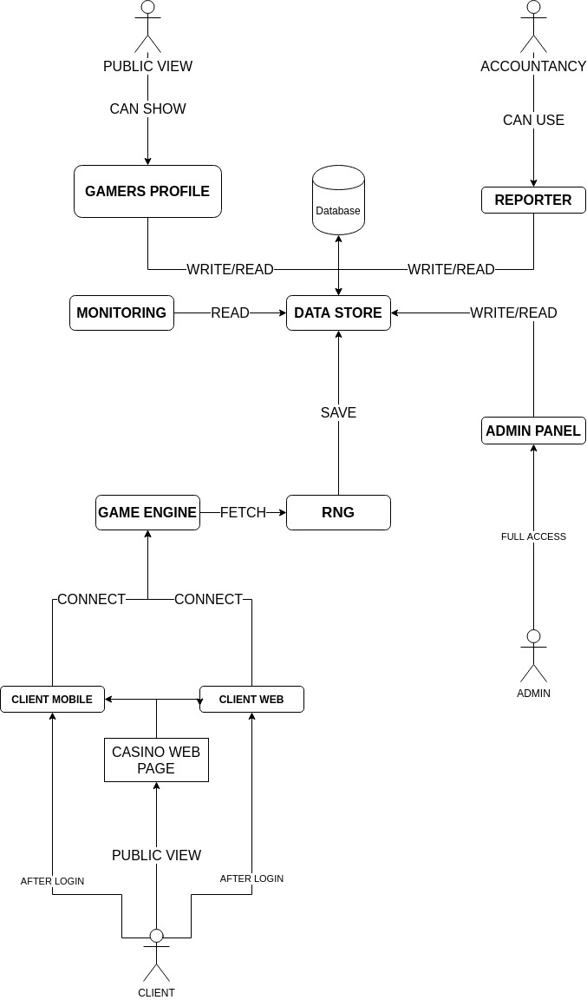

# loterio-ma
The main repository of the LoterioMa casino infrastructure project. It serves for documentation and organization of projects included in the system.

## Goal
The goal of the project is to create a complete broken casino system responsible for operating online casinos. A very important aspect is the construction of the system from microservices that communicate with each other.

## Concept diagram

Simple view of whole system architecture:


## Database data

#### User 

The user base object for using the system. The field consists of the following data:

```
**ID** - identifier*
**Email** - email address*
**Password** - field contains hashed password.
```

#### Game
Represents definition of specific game.

```
**ID** - identifier
**Name** - game name as string (title of game)
**Slug** - sluggable name of game (usable to generate urls)
**Type** - relation to GameType object.
```

#### GameType

An object that represents the type of game. Basically we have two types of game - slots and cards.
```
**ID** - identifier*
**Name** - type name
**Description** - game type description.
```

## Communication issues

The system oriented in the microservice architecture depends on continuous communication between subsystems. Due to the nature of the system, the performance (time) aspects of the solution used are important.
The following methods are available:
REST API
WebSocket
Mercure

- RESEARCH HERE -

## Components
1. **RNG** - random number generator, the system responsible for obtaining the numbers that make up the game.
2. **Game client** - the game client is an application that allows you to send requests to the game server, it is also responsible for all operations related to it (logging in, resetting the game state). Ultimately, there can be an unlimited number of game clients.
3. **DataStore** - system data warehouse, all data is saved here. Each system uses this storage to get synchronized data.
4. **AdminPanel** - casino management panel, a place where we can add games, machines, administer the entire system from the administrative side.
5. **Database** - physical database engine, casino registration is done via the DataStore website.
6. **Game engine** - game engine. It is a service that combines data from RNG with the game object and returns the state of the given throw to the client. He is also responsible for saving all objects participating in the game and for updating user funds on the whole system. (Should funds be kept on the wallet service?).
7. **Monitoring** - a system that allows you to view the status of the casino in real time.
8. **Casino Web Page** - the casino home page gives you access to all services for users.
9. **CasinoEngineer** - here we create devops.

## Data centralization

In order for all services to have access to data and to avoid redundancy, all data should be stored in an accessible service (such a data warehouse). Each of the websites will gain access to interesting data through the API.

## Dictionary

The dictionary is used to define frequently used domain words, any word that cannot be defined by using the definitions already available in the dictionary should go to the dictionary. Definitions should be specific, each sub-definition should be distinguished.

**Casino system** - a complete network of systems enabling the use of the casino from both the administrative and client side. It consists of a series of communicating microservices.
**Users** - all people have access to the system. Due to the type of access to the system, we distinguish:
**User** - simple user, gamer.
**Admin** - whole system administrator, can to manage whole system and configure casino.
**Game** - a game understood as a specific type of game, e.g. slots or card games. Each game has: name, type, icon, description.
**Game type** - the game type defines according to which basic rules the game is played. Available game types: slots and cards. 
**Game type - slot** - type of game based on a machine consisting of rolls (rolls). The size and specific settings of the game are defined on its level.
**Game type - card** - the base type of game based on the deck of cards.
**Casino** - we understand the casino as instances of the entire system.
**Data Store** - main casino data store, service enabling reading and adding casino data and their exchange between systems.
